# Scientific Analysis with AI Agent Workspaces

!!! abstract "Assignment Overview"

    In this assignment, you will use a **science agent workspace** to complete three small but realistic computational biology tasks:

    1. **EGFR mutation analysis** of G719S, T790M, and L858R
    2. **Single-cell RNA-seq analysis and robustness testing**
    3. **Spatial transcriptomics and spatial organization**

    These tasks are designed to run on a **normal laptop**. You do not need a GPU, and you will not train any machine-learning models.

    The goal is not simply to obtain an answer from an AI model. You will use an agent to **plan an analysis, execute code, inspect results, use scientific databases, test assumptions, and evaluate whether its conclusions are supported by evidence**.

---

## Checkpoints and grading at a glance

Use the checkpoints below as a progress check. A checkpoint is complete when you can point to the **result and the code or source behind it** in your submission. The [100-point grading rubric](grading_rubric.md) gives the point value and expected evidence for each checkpoint.

| Checkpoints | What you should be able to show | Points |
| --- | --- | ---: |
| **P1–P4 · Protein** | Verified sequence/structure mapping, measurements, an annotated structure, and a mutation comparison with uncertainty | 25 |
| **S1–S5 · Single-cell** | QC and baseline, marker-based labels, resolution and downsampling comparisons, and one investigated ambiguous population | 25 |
| **T1–T5 · Spatial** | Expression-only clusters on tissue, spatial statistic and genes, DE comparison, and a randomized null result | 25 |
| **A · Agent audit** | For **each** task: sources, computed versus retrieved information, one independent check, and one weakness or limitation | 15 |
| **R · Reproducibility and report** | Ordered code, data sources, settings/seeds, figures tied to results, and a checkpoint evidence list | 10 |
| **Total** | | **100** |

There is no required biological answer or target value. You are graded on whether your methods are appropriate, results are actually shown, and conclusions match the evidence. Before submission, mark each checkpoint in your report as **complete** or **needs revision** and give the page or file that contains its evidence.

---

## 1. Science Agent Workspaces

Large language models are increasingly being used as interactive scientific assistants. A science agent workspace extends a language model with tools that allow it to do more than answer questions in natural language.

A typical workspace may allow an agent to:

* read local files and datasets,
* search scientific literature and databases,
* write and execute Python or R,
* inspect intermediate results,
* generate figures and tables,
* revise an analysis when something goes wrong,
* maintain a record of how a result was produced.

The workflow therefore looks less like a normal chatbot conversation and more like a small interactive research environment:

```text
Research question
       ↓
Agent proposes a plan
       ↓
Search databases / literature
       ↓
Write and execute analysis code
       ↓
Inspect intermediate results
       ↓
Run additional checks or controls
       ↓
Generate figures and conclusions
       ↓
Human reviews the evidence
```

### Claude Science and GPT-Rosalind Workbench

**Claude Science** is Anthropic's scientific research workspace. It combines Claude with scientific tools, computational environments, files, databases, and external computing resources. A researcher can describe a scientific objective and interact with the agent while it performs a multi-step analysis.

**GPT-Rosalind / Rosalind Workbench** follows a similar idea with a stronger focus on life-science workflows. It is designed to help researchers work with biological data, scientific evidence, sequencing workflows, computational tools, and reusable analysis procedures.

<div class="figure-grid">
  <figure class="figure-card figure-card--overview">
    <a href="images/claude-science-workflow.webp">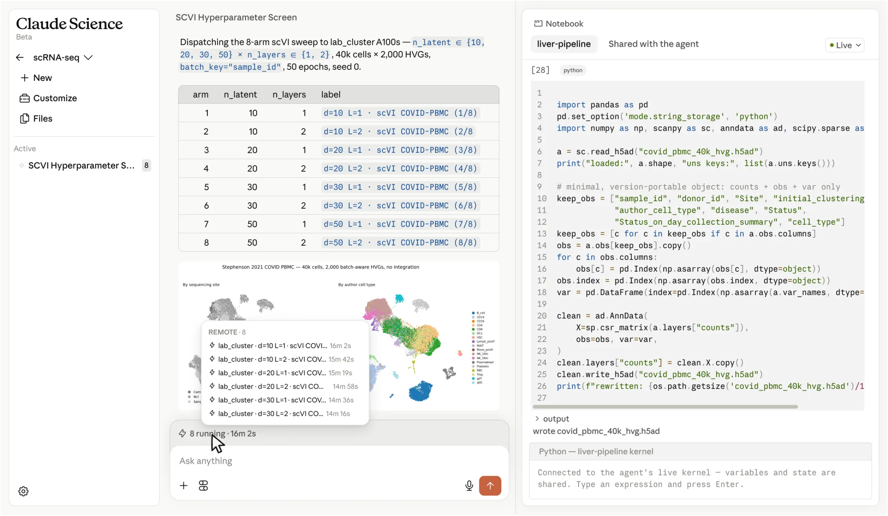</a>
    <figcaption><strong>Claude Science:</strong> an agent organizes an scVI parameter sweep beside executable notebook code. This is an <a href="https://claude.com/product/claude-science">official product example</a>, not a result from this assignment. Click to enlarge.</figcaption>
  </figure>
  <figure class="figure-card figure-card--overview">
    <a href="images/gpt-rosalind-single-cell.webp">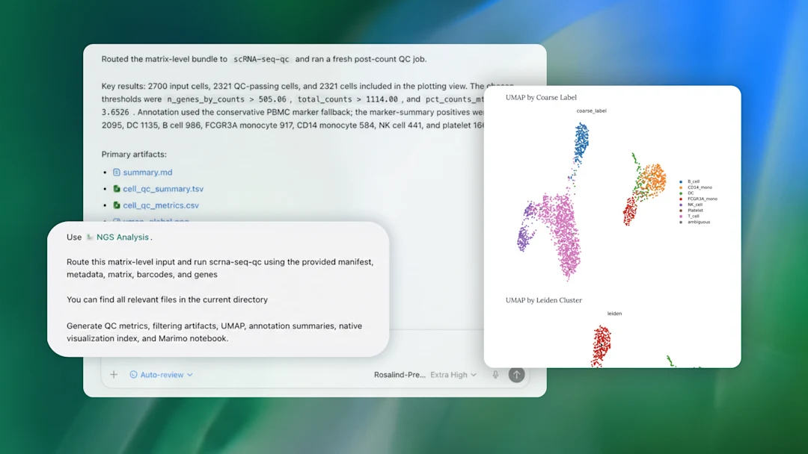</a>
    <figcaption><strong>GPT-Rosalind:</strong> a single-cell QC request leads to saved artifacts and plots in an <a href="https://openai.com/gpt-rosalind/">official product example</a>. The task below still requires you to inspect the code and evidence. Click to enlarge.</figcaption>
  </figure>
</div>

Although their implementations differ, both systems illustrate the same important idea:

> ==A scientific agent should not only generate an answer. It should be able to perform and document the analysis that supports that answer.==

---

## 2. Open-Source Workspace: Synthetic Sciences OpenScience

For this assignment, the recommended open-source implementation is **Synthetic Sciences OpenScience**.

OpenScience provides a workspace in which an AI agent can interact with local files, computational environments, scientific resources, and external tools. Instead of manually switching between a chatbot, terminal, notebook, browser, and scientific databases, these capabilities can be coordinated through a single agent.

A simplified architecture is:

```text
                         ┌─────────────────┐
                         │ Research prompt │
                         └────────┬────────┘
                                  │
                                  ▼
                         ┌─────────────────┐
                         │ OpenScience     │
                         │ Agent           │
                         └────────┬────────┘
                                  │
              ┌───────────────────┼───────────────────┐
              ▼                   ▼                   ▼
       Literature / Web       Python / R        Scientific tools
          databases           execution          and databases
              │                   │                   │
              └───────────────────┼───────────────────┘
                                  ▼
                        Figures, tables, code,
                        evidence, and conclusions
```

This makes OpenScience particularly useful for this assignment because each of the three tasks requires the agent to combine **computation with scientific reasoning**.

<figure class="figure-card">
  <a href="images/openscience-workspace.png">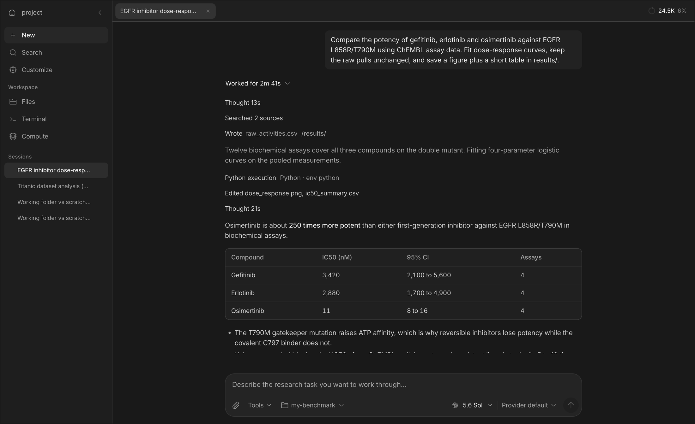</a>
  <figcaption><strong>Where to look:</strong> <em>Customize</em> is in the left sidebar, the activity and evidence trail is in the center, and the selected model appears below the prompt. This <a href="https://github.com/synthetic-sciences/openscience/blob/main/assets/workspace.png">official OpenScience screenshot</a> is a product demonstration using EGFR data, not a worked answer. Click to enlarge.</figcaption>
</figure>

!!! important "You are still responsible for the analysis"

    OpenScience can generate code, select tools, interpret results, and search for evidence. None of these actions are guaranteed to be correct.

    You should treat the agent as a **research assistant**, not as an authority.

---

## 3. Choosing a Model

OpenScience is the workspace, but it still requires an underlying language model.

=== "If you already have a science-agent workspace"

    If you can use Claude Science, Rosalind Workbench, or another science-agent workspace with file access and code execution, you may use it for this assignment. An ordinary chat subscription does not necessarily include API credentials for OpenScience; check your selected provider's connection and billing method before starting.

    Stronger models generally perform better at:

    - multi-step planning,
    - choosing appropriate tools,
    - debugging code,
    - interpreting scientific results,
    - recognizing when an analysis has failed.

    You may still use OpenScience if you prefer the open-source workspace.

=== "If you want a free option"

    You can use:

    **OpenScience + OpenRouter + a free model**

    **OpenRouter** provides a common API interface for many language models from different providers. Some models are available through free inference tiers.

    The basic setup is:

    ```text
    OpenScience
         ↓
    OpenRouter API
         ↓
    Free language model
    ```

    Free models can be sufficient for this assignment, but their performance may vary considerably.

    In particular, weaker models may have more difficulty with:

    - long analysis plans,
    - tool selection,
    - debugging,
    - interpreting biological results,
    - keeping track of previous analysis steps.

    !!! warning

        A model being free does **not** mean that it is appropriate for agent workflows.

        When selecting a model, prefer one that supports **tool use / function calling** and has a reasonably large context window.

    Free models available through OpenRouter can change over time, so you do not need to use the same model as other students.

<figure class="figure-card">
  <a href="images/openrouter-free-models.png"></a>
  <figcaption><strong>Find a model:</strong> the <a href="https://openrouter.ai/collections/free-models">OpenRouter free-model collection</a> displays current candidates and prices. This screenshot was captured in September 2026; rankings and availability change. Open each candidate's details to check tool calling and context length. Click to enlarge.</figcaption>
</figure>

---

## 4. Installing and Configuring OpenScience

You only need to complete this setup once.

### Install OpenScience

Choose one installation method.

=== "npm"

    ```bash
    npm install -g @synsci/openscience
    ```

    Start it with:

    ```bash
    openscience
    ```

=== "Run without installing"

    ```bash
    npx synsci
    ```

=== "macOS / Linux installer"

    ```bash
    curl -fsSL https://openscience.sh/install | bash
    ```

Once OpenScience starts correctly, create a workspace for this assignment.

A simple layout **inside the cloned repository** is:

```text
GenAIBioMedAssignment3/
├── datasets/                 # supplied inputs
├── protein/
├── single_cell/
└── spatial/
```

Open the repository root so the agent can see the supplied `datasets/` folder as well as your task folders. From that root, run:

```bash
openscience
```

### Configure your model

OpenScience allows you to configure model providers from the interface or command line.

From the interface, open:

```text
Customize → Models
```

or use:

```bash
openscience keys add
```

If you are using OpenRouter, add your OpenRouter API key and select an appropriate model.

For an independent Python environment on macOS or Linux, Python 3.12 is a practical choice for current Scanpy and Squidpy releases:

```bash
python3.12 -m venv .venv
. .venv/bin/activate
python -m pip install 'scanpy[leiden]' squidpy
```

On Windows, run these Linux commands inside WSL2 (for example, Ubuntu). An agent may manage its own environment instead; either way, record the versions used for your submitted analysis.

For the OpenRouter route:

1. Create a key on the [OpenRouter API Keys page](https://openrouter.ai/settings/keys).
2. Find a suitable text model in the [free-model collection](https://openrouter.ai/collections/free-models); confirm that it supports tool calling and check its current rate limits.
3. In OpenScience, open **Customize → Models**, connect **OpenRouter**, enter the key, and select that model. The [OpenScience setup instructions](https://github.com/synthetic-sciences/openscience#install) also show the `openscience keys add` route.
4. Try a small prompt that reads a file and runs a short calculation. Confirm that the selected model can actually use tools before starting the assignment.

!!! danger "Never expose API keys"

    Do **not** include API keys in:

    - your report,
    - screenshots,
    - notebooks,
    - GitHub repositories,
    - submitted code,
    - shared configuration files.

---

## 5. How to Work with the Agent

For all three tasks, we recommend the same general workflow.

Do **not** begin by asking the agent to produce a complete final report.

Instead, treat the analysis as an interactive process:

```text
1. Explain the scientific question
              ↓
2. Ask the agent to propose a plan
              ↓
3. Review the plan
              ↓
4. Let it perform the first analysis
              ↓
5. Inspect code, figures, and intermediate results
              ↓
6. Question weak or surprising results
              ↓
7. Ask for controls or additional analysis
              ↓
8. Decide which conclusions are actually supported
```

A useful first request is:

```text
Before running the analysis, propose a clear analysis plan.
Explain what data, software, databases, and statistical methods
you intend to use and why.
```

!!! tip "Interact with the agent"

    Good use of a science agent should involve follow-up questions.

    For example:

    > Why did you choose this clustering parameter?

    > What evidence supports this cell-type annotation?

    > Can you test whether this result remains stable with another parameter?

    > Is this conclusion computed from the data, or retrieved from a database?

    > What would be an appropriate negative control?

The three tasks below are designed so that the **first result should not be the end of the analysis**.

---

## Data supplied for this assignment

The repository includes the input files below in [`datasets/`](https://github.com/GenAIBioMed/GenAIBioMedAssignment3/tree/main/datasets). Download links point both to the repository copy and to the original source. Task 1 uses human **EGFR (UniProt P00533)** and the three canonical-sequence variants **G719S, T790M, and L858R**. The bundled 4HJO structure is its required starting structure; you may add a better-suited structure if you justify the choice.

| Use | Repository download | Original source | Size |
| --- | --- | --- | ---: |
| **Task 2:** PBMC3k filtered counts | [PBMC3k matrix archive](https://github.com/GenAIBioMed/GenAIBioMedAssignment3/raw/refs/heads/main/datasets/pbmc3k/pbmc3k_filtered_gene_bc_matrices.tar.gz) | [10x Genomics PBMC3k](https://cf.10xgenomics.com/samples/cell-exp/1.1.0/pbmc3k/pbmc3k_filtered_gene_bc_matrices.tar.gz) | 7.3 MiB |
| **Task 3:** adult mouse-brain Visium counts | [Visium count matrix](https://github.com/GenAIBioMed/GenAIBioMedAssignment3/raw/refs/heads/main/datasets/visium_mouse_brain/V1_Adult_Mouse_Brain_filtered_feature_bc_matrix.h5) | [10x Genomics count matrix](https://cf.10xgenomics.com/samples/spatial-exp/1.1.0/V1_Adult_Mouse_Brain/V1_Adult_Mouse_Brain_filtered_feature_bc_matrix.h5) | 20.1 MiB |
| **Task 3:** matching spatial coordinates and tissue images | [Visium spatial archive](https://github.com/GenAIBioMed/GenAIBioMedAssignment3/raw/refs/heads/main/datasets/visium_mouse_brain/V1_Adult_Mouse_Brain_spatial.tar.gz) | [10x Genomics spatial archive](https://cf.10xgenomics.com/samples/spatial-exp/1.1.0/V1_Adult_Mouse_Brain/V1_Adult_Mouse_Brain_spatial.tar.gz) | 8.6 MiB |
| **Task 1:** EGFR kinase-domain structure | [4HJO mmCIF](https://github.com/GenAIBioMed/GenAIBioMedAssignment3/raw/refs/heads/main/datasets/protein/4hjo.cif.gz) · [4HJO PDB](https://github.com/GenAIBioMed/GenAIBioMedAssignment3/raw/refs/heads/main/datasets/protein/4hjo.pdb) | [RCSB PDB 4HJO](https://www.rcsb.org/structure/4HJO) | 71 + 219 KiB |

If you cloned the repository, these files are already under `datasets/`. Extract the two archives once from the repository root:

```bash
tar -xzf datasets/pbmc3k/pbmc3k_filtered_gene_bc_matrices.tar.gz -C datasets/pbmc3k
tar -xzf datasets/visium_mouse_brain/V1_Adult_Mouse_Brain_spatial.tar.gz -C datasets/visium_mouse_brain
```

The PBMC3k matrix then lives in `datasets/pbmc3k/filtered_gene_bc_matrices/hg19/`. For Visium, keep the `.h5` file and extracted `spatial/` folder together in `datasets/visium_mouse_brain/`. See the [dataset README](https://github.com/GenAIBioMed/GenAIBioMedAssignment3/blob/main/datasets/README.md) for checksums, provenance, and loading examples. Record the exact input file names and any filtering decisions in your report.

---

# Task 1 — Predicting the Effects of Protein Mutations

## Scientific Question

Analyze human **EGFR (UniProt P00533)** and compare the missense variants **G719S, T790M, and L858R**, using canonical EGFR residue numbering. Begin with the supplied **4HJO chain A** structure with bound erlotinib (ligand AQ4). Its residue labels differ from canonical EGFR numbering, and its deposited construct has an engineered V948R substitution. Verify the mapping and account for these limitations; a distance in 4HJO is a measurement of the unmutated residue in that structure, not a direct measurement of a mutant protein.

Your goal is to determine:

> **Which mutations are most likely to affect protein function, and what molecular mechanism could explain their effects?**

You should integrate multiple types of evidence rather than relying on a single prediction.

The overall reasoning should look like:

```text
Protein sequence
      +
Protein structure
      +
Functional annotations
      +
Scientific literature
      ↓
Evidence for each mutation
      ↓
Mechanistic hypothesis
```

---

## Suggested Analysis

Start by asking the agent to retrieve basic information about the protein. Relevant information may include its biological function, domains, catalytic residues, binding sites, ligands, and known structures.

Useful resources may include:

* UniProt,
* RCSB Protein Data Bank,
* AlphaFold Database,
* scientific literature.

Next, map the candidate mutations onto an appropriate structure.

For each mutation, investigate questions such as:

* Is the residue located inside an important domain?
* Is it close to a catalytic or functional residue?
* Is it close to a ligand or binding interface?
* Is the residue buried inside the protein or exposed to solvent?
* Does the mutation cause a major change in charge, polarity, or residue size?
* Is the structural region itself reliable?

Whenever possible, support these observations with **quantitative measurements**.

For example:

```text
Mutation → active-site distance
Mutation → ligand distance
Nearby residues within 5 Å
```

A statement such as:

> "This mutation is close to the active site."

is much weaker than:

> "The mutated residue is 4.1 Å from a catalytic residue and lies within the same conserved domain."

<figure class="figure-card">
  <a href="images/egfr-ligand-distances.png">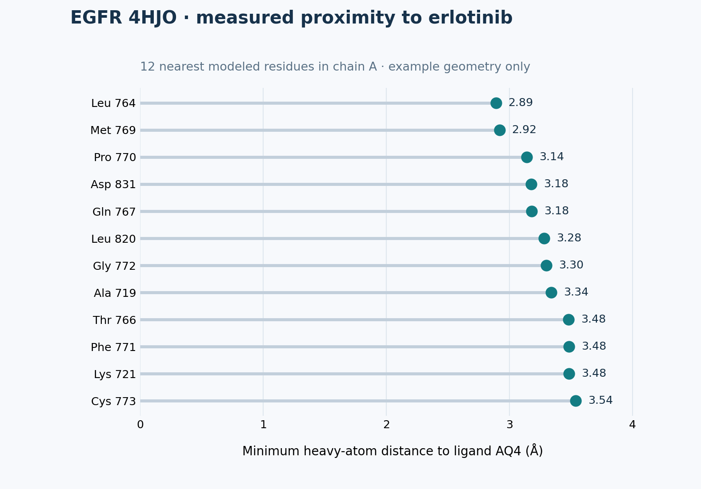</a>
  <figcaption><strong>Measurement example:</strong> the 12 closest modeled chain-A residues to erlotinib (AQ4) in <a href="https://www.rcsb.org/structure/4HJO">4HJO</a>, measured as the minimum heavy-atom distance. The <a href="https://github.com/GenAIBioMed/GenAIBioMedAssignment3/blob/main/scripts/render_4hjo_contacts.py">plotting code</a> and coordinate file are supplied. Proximity alone does not show what a mutation will do; map and measure all three assigned EGFR sites in your own analysis. Click to enlarge.</figcaption>
</figure>

---

### Distinguish Observation from Interpretation

A major goal of this task is to separate what the data show from what you infer.

| Type                  | Example                                                                     |
| --------------------- | --------------------------------------------------------------------------- |
| **Observation**       | The residue is 4.1 Å from the bound ligand.                                 |
| **Prediction**        | The mutation may interfere with ligand binding.                             |
| **External evidence** | Previous studies report that this region contributes to ligand recognition. |

==Do not present a prediction as if it were directly observed.==

---

### Example Starting Prompt

```text
I want to evaluate how several missense mutations may affect this protein.

First create an analysis plan. Use protein sequence, structural information,
functional annotations, and scientific literature.

Whenever possible, perform quantitative structural analysis rather than
relying only on visual inspection.

For each mutation, clearly separate:
1. observations from the data,
2. mechanistic predictions,
3. external evidence.
```

You should modify your prompts as the analysis progresses.

---

### Expected Results

Your final protein analysis should include:

* a short description of the protein,
* a table comparing all candidate mutations,
* at least one structural visualization showing mutation locations,
* quantitative structural evidence where appropriate,
* a mechanistic interpretation of each mutation,
* supporting database or literature evidence.

A useful summary table might look like:

| Mutation   | Structural context | Quantitative evidence         | Interpretation       | Confidence |
| ---------- | ------------------ | ----------------------------- | -------------------- | ---------- |
| Mutation A | Near active site   | 4.1 Å from ligand             | May disrupt binding  | High       |
| Mutation B | Surface loop       | No nearby functional residues | Effect uncertain     | Low        |
| Mutation C | Protein core       | Multiple hydrophobic contacts | May destabilize fold | Moderate   |

<div class="figure-explain">
  <figure>
    <a href="images/egfr-4hjo.jpeg">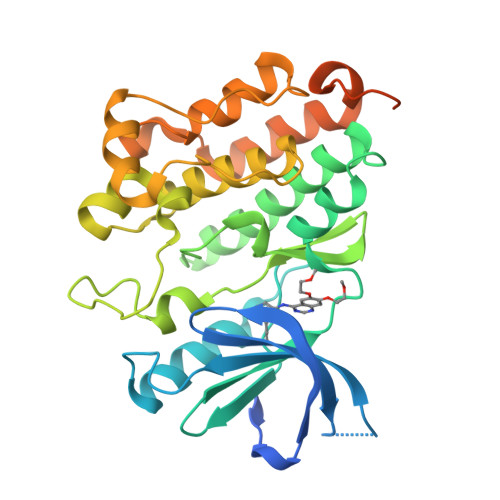</a>
    <figcaption><strong>Starting structure:</strong> experimental EGFR kinase domain with erlotinib, <a href="https://www.rcsb.org/structure/4HJO">RCSB PDB 4HJO</a>. No candidate mutation is marked. Click to enlarge.</figcaption>
  </figure>
  <div class="figure-guide">
    <h4>Turn a structure image into evidence</h4>
    <ol>
      <li>Record the PDB ID, chain, ligand, residue numbering, and which assigned positions are covered.</li>
      <li>Mark G719S, T790M, and L858R on the structure after mapping canonical to PDB numbering.</li>
      <li>Measure relevant atom-to-atom distances and state the measurement rule.</li>
      <li>Explain what the geometry suggests, with an explicit uncertainty statement.</li>
    </ol>
    <p>Start from the bundled <a href="https://github.com/GenAIBioMed/GenAIBioMedAssignment3/raw/refs/heads/main/datasets/protein/4hjo.cif.gz">4HJO structure</a>. Its construct contains V948R and represents an inactive, ligand-bound conformation. Discuss how these conditions limit claims about the three EGFR substitutions; additional structures may strengthen your comparison.</p>
  </div>
</div>

!!! success "Protein checkpoints · 25 points"

    - **P1:** Confirm the protein, mutation notation, and residue mapping to the chosen structure or model.
    - **P2:** Show reproducible structural measurements for the candidates, or document why a measurement is not valid and use a justified alternative.
    - **P3:** Separate observed facts, mechanistic predictions, external evidence, and uncertainty in the mutation comparison.
    - **P4:** Include an annotated structure and a comparison table covering every candidate.

    See the [grading summary](grading_rubric.md#task-1-protein-mutation-analysis-25-points).

---

# Task 2 — Single-Cell Cell Types and Robustness

## Scientific Question

For this task, analyze the **PBMC3k single-cell RNA-seq dataset** supplied as a [filtered count-matrix archive](#data-supplied-for-this-assignment). Extract it as shown above; begin from the counts, without preassigned cell-type labels.

Your goal is not only to identify major immune-cell populations, but also to ask:

> **Which biological conclusions remain stable when reasonable analysis choices are changed?**

This makes the task different from simply reproducing a standard Scanpy tutorial.

---

## Build a Baseline Analysis

Ask the agent to develop a reasonable single-cell analysis workflow.

A typical workflow may contain:

```text
Expression matrix
      ↓
Quality control
      ↓
Normalization
      ↓
Highly variable genes
      ↓
PCA
      ↓
Cell-cell neighbor graph
      ↓
Clustering
      ↓
Marker genes
      ↓
Cell-type annotation
```

You do not need to tell the agent every Scanpy command.

Part of the assignment is evaluating whether the agent chooses and correctly implements a reasonable workflow.

Once clusters have been identified, use **marker genes derived from the data** to annotate major cell populations.

<figure class="figure-card">
  <a href="images/scanpy-qc-example.png">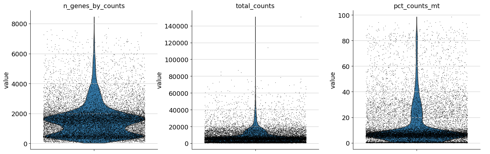</a>
  <figcaption><strong>QC example:</strong> the <a href="https://scanpy.readthedocs.io/en/stable/tutorials/basics/clustering.html#quality-control">Scanpy preprocessing tutorial</a> inspects genes per cell, total counts, and mitochondrial fraction before choosing filters. It uses a different BMMC dataset; choose and justify thresholds from your own PBMC3k measurements. Click to enlarge.</figcaption>
</figure>

The reasoning should follow:

```text
Observed cluster
      ↓
Marker genes from the dataset
      ↓
Possible biological identity
      ↓
Database / literature evidence
      ↓
Final annotation
```

!!! warning

    Do not accept a cell-type label simply because the agent produced it.

    The annotation should be supported by the expression pattern of biologically meaningful marker genes.

---

## Test Whether the Result Is Robust

After obtaining a reasonable baseline result, change the clustering conditions.

Compare at least three Leiden resolutions while keeping the other preprocessing and neighbor settings fixed. One reasonable set is:

```text
resolution = 0.3
resolution = 0.6
resolution = 1.0
```

You are not trying to find one "correct" resolution.

<figure class="figure-card">
  <a href="images/scanpy-resolution-example.png">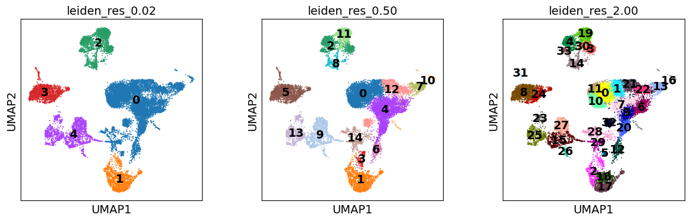</a>
  <figcaption><strong>Resolution comparison:</strong> <a href="https://scanpy.readthedocs.io/en/stable/tutorials/basics/clustering.html#clustering">Scanpy's example</a> shows how the same embedding can split into more groups as Leiden resolution increases. It uses a different dataset and different values; your report should compare biological labels and markers as well as cluster counts. Click to enlarge.</figcaption>
</figure>

Instead, ask:

* Which populations appear consistently?
* Which clusters split at higher resolution?
* Which populations merge at lower resolution?
* Do the biological annotations remain stable?

Next, perform a simple **downsampling experiment**.

For example, randomly retain approximately 70% of the cells (any fraction from 60–80% is acceptable), record the seed, and repeat the relevant baseline analysis steps.

Compare the downsampled result with the original analysis **on cells present in both runs** using appropriate evidence such as:

* cluster composition,
* marker genes,
* cell-type annotations,
* ARI,
* NMI.

You do not need to use every possible metric. Choose comparisons that help answer the biological question.

---

## Investigate an Ambiguous Population

Select at least one population that is difficult to annotate or unstable across your analyses.

Investigate why.

Possible explanations include:

* closely related cell types,
* shared marker genes,
* continuous biological states,
* small population size,
* technical noise,
* sensitivity to clustering parameters.

This part is important because real biological data rarely produce perfectly separated groups.

!!! question "Think biologically"

    If two populations are difficult to separate, do not immediately conclude that the clustering algorithm failed.

    Ask whether the biology itself may represent a continuum rather than two sharply separated cell types.

---

### Example Starting Prompt

```text
Analyze the PBMC3k dataset and identify its major cell populations.

Do not use predefined cell labels.

First propose a reasonable single-cell analysis plan. Use marker genes
derived from the data to support each annotation.

After obtaining a baseline result, test whether the main biological
conclusions remain stable when clustering parameters are changed and
when the dataset is downsampled.

Finally, identify at least one ambiguous or unstable population and
investigate why it is difficult to separate.
```

---

### Expected Results

Your final single-cell analysis should include:

* an annotated UMAP,
* marker-gene evidence for the major populations,
* a comparison across several clustering parameters,
* a downsampling robustness analysis,
* a discussion of at least one ambiguous population.

A useful summary table might be:

| Cell population | Main marker genes | Stable across resolutions? | Stable after downsampling? | Notes                     |
| --------------- | ----------------- | -------------------------- | -------------------------- | ------------------------- |
| Population A    | ...               | Yes                        | Yes                        | Clearly separated         |
| Population B    | ...               | Mostly                     | Yes                        | Splits at high resolution |
| Population C    | ...               | No                         | No                         | Ambiguous population      |

<figure class="figure-card">
  <a href="images/pbmc-reference-umap.png">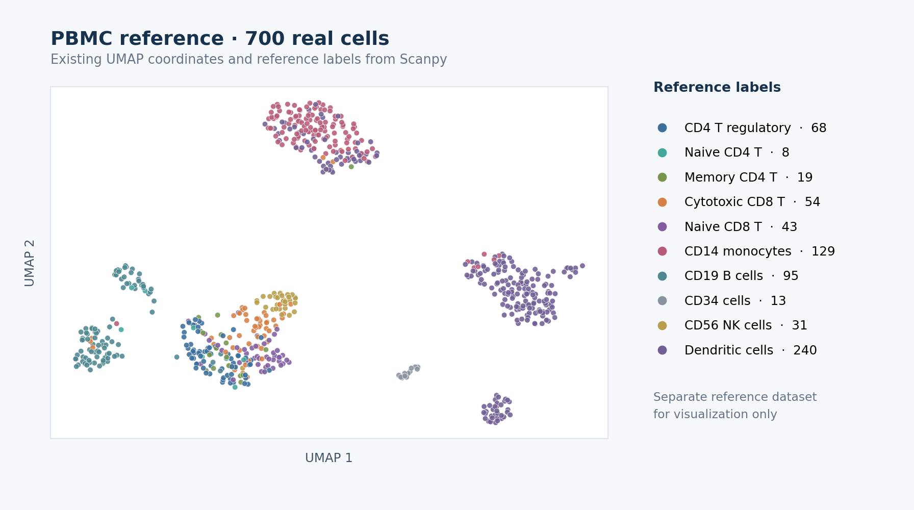</a>
  <figcaption><strong>Annotated UMAP example:</strong> real cells and reference labels from <a href="https://scanpy.readthedocs.io/en/stable/tutorials/plotting/core.html">Scanpy's reduced PBMC68k dataset</a>, plotted for this page. This is a different dataset from your PBMC3k analysis; do not copy these labels or expect this layout. Click to enlarge.</figcaption>
</figure>

!!! success "Single-cell checkpoints · 25 points"

    - **S1:** Record QC decisions and a reproducible baseline, including cluster counts and a cluster-labeled UMAP.
    - **S2:** Support major cell labels with markers computed from the data; retain uncertain labels where needed.
    - **S3:** Compare at least three Leiden resolutions while keeping other settings fixed, and quantify a meaningful change.
    - **S4:** Rerun a fixed-seed 60–80% cell subsample and compare it with the baseline on retained cells.
    - **S5:** Investigate one ambiguous or unstable population with marker evidence.

    See the [grading summary](grading_rubric.md#task-2-single-cell-analysis-25-points).

The final discussion should answer:

> **Which biological conclusions are robust, and which depend strongly on analytical choices?**

---

# Task 3 — Spatial Transcriptomics and Non-Random Tissue Organization

## Scientific Question

For the final task, use the **V1 Adult Mouse Brain Visium** count matrix, spatial coordinates, and tissue images supplied in [`datasets/visium_mouse_brain/`](https://github.com/GenAIBioMed/GenAIBioMedAssignment3/tree/main/datasets/visium_mouse_brain). The two required downloads are listed in the [data table](#data-supplied-for-this-assignment).

The central question is:

> **Do transcriptionally defined tissue domains correspond to genuine non-random spatial organization?**

This task combines expression analysis, spatial statistics, visualization, and a simple null experiment.

<div class="figure-explain">
  <figure>
    <a href="images/visium-v1-input-tissue.png">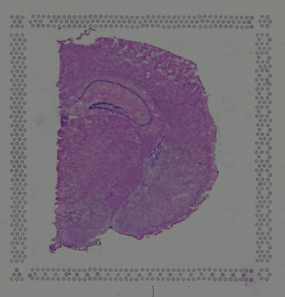</a>
    <figcaption><strong>Your actual input:</strong> low-resolution histology image from the bundled <a href="https://cf.10xgenomics.com/samples/spatial-exp/1.1.0/V1_Adult_Mouse_Brain/V1_Adult_Mouse_Brain_spatial.tar.gz">10x V1 Adult Mouse Brain spatial archive</a>. Click to enlarge.</figcaption>
  </figure>
  <div class="figure-guide">
    <h4>Three inputs, two separate stages</h4>
    <ol>
      <li>Use the count matrix to define expression-based spot clusters.</li>
      <li>Use the spatial coordinates to map those clusters back onto the tissue and define physical neighbors.</li>
      <li>Use the histology image as context for the map, without using it to create the initial clusters.</li>
    </ol>
  </div>
</div>

---

## First Identify Domains Without Using Spatial Coordinates

Begin by clustering spots using only gene-expression information.

Do **not** use spatial coordinates during this step.

A reasonable workflow may look like:

```text
Gene expression
      ↓
Feature selection
      ↓
PCA
      ↓
Expression-based neighbor graph
      ↓
Clustering
```

These groups are therefore defined by their transcriptional profiles rather than their physical locations.

Once the clusters have been identified, plot the same cluster labels using the true spatial coordinates.

You can now compare:

```text
Expression space                Physical tissue space
      ↓                                  ↓
Which spots have                Where are those spots
similar expression?             located in the tissue?
```

Ask whether the expression-defined domains:

* form clear spatial regions,
* appear spatially mixed,
* have recognizable boundaries,
* tend to occur next to specific other domains.

<figure class="figure-card">
  <a href="images/squidpy-visium-closeup.png">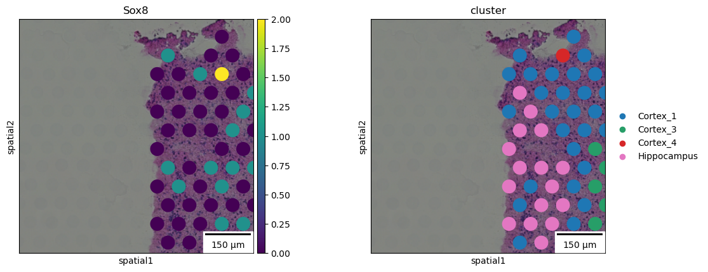</a>
  <figcaption><strong>Spatial overlay example:</strong> a real Visium mouse-brain crop from the <a href="https://squidpy.readthedocs.io/en/stable/notebooks/examples/plotting/plot_scatter.html">Squidpy plotting tutorial</a> shows Sox8 expression and pre-existing annotations over histology. It illustrates the plotting method, not the expression-only domains you must compute from the supplied V1 dataset. Click to enlarge.</figcaption>
</figure>

---

## Quantify Spatial Organization

Visual inspection is useful, but it is not sufficient.

Use an appropriate quantitative spatial method such as:

* neighborhood enrichment,
* Moran's I,
* spatial autocorrelation,
* another justified spatial statistic.

The agent should explain what the statistic measures and why it is relevant to the question.

For example, if a cluster strongly neighbors itself in physical space, this provides quantitative evidence that the transcriptional domain is spatially coherent.

<figure class="figure-card">
  <a href="images/squidpy-neighborhood-enrichment.png">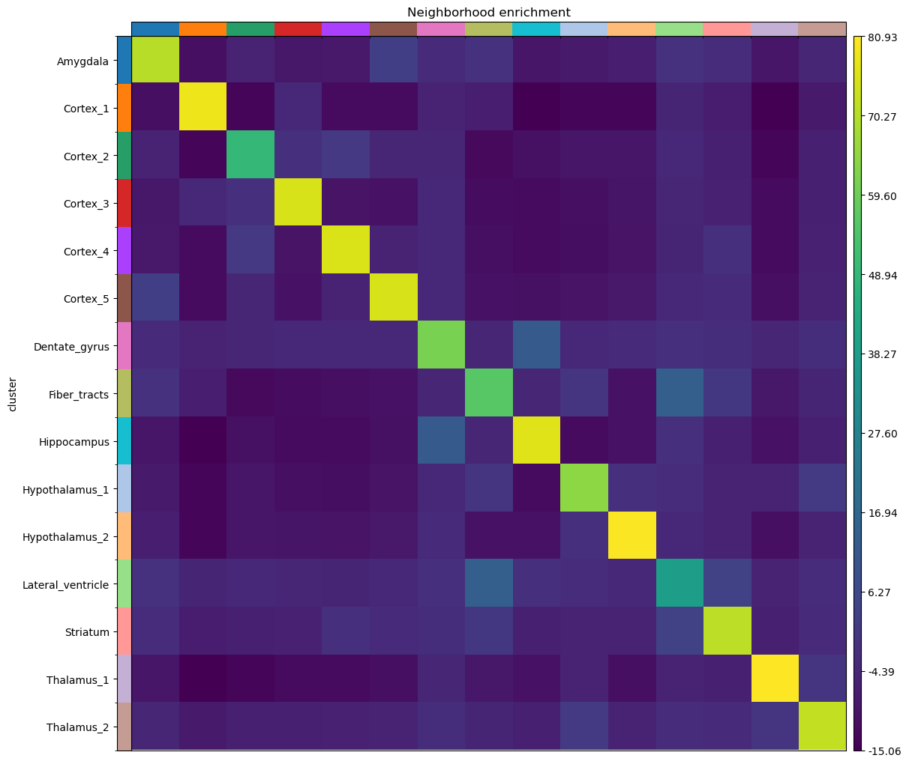</a>
  <figcaption><strong>Spatial statistic example:</strong> a <a href="https://squidpy.readthedocs.io/en/stable/notebooks/examples/graph/compute_nhood_enrichment.html">Squidpy tutorial heatmap</a> summarizes observed neighbor relationships against permutations. Its pre-existing region labels are illustrative; for this assignment, use your own expression-only clusters and state how the spatial graph and null were built. Click to enlarge.</figcaption>
</figure>

---

## Identify Spatially Variable Genes

Next, identify genes whose expression has strong spatial organization.

For example:

```text
Strong spatial pattern           Weak spatial pattern

████████                          █░██░█░█
████████                          ░█░░██░█
░░░░░░░░                          ██░█░░██
░░░░░░░░                          ░██░█░░█
```

To keep the analysis lightweight, it is reasonable to restrict this analysis to approximately **100–300 highly variable genes**.

---

## Compare Differential Expression with Spatial Variation

A gene can be a strong cluster marker without having the strongest spatial pattern.

Likewise, a spatially organized gene may not be one of the top differential-expression markers.

Compare:

```text
Differential-expression ranking
                vs.
Spatial-autocorrelation ranking
```

Identify examples of genes that are:

1. strong in both rankings,
2. strong differential-expression markers but weak spatial genes,
3. strong spatial genes but weaker differential-expression markers.

Explain why these two analyses measure different properties.

---

## Build a Negative Control

Finally, test whether the observed spatial organization is stronger than expected by chance.

Design a simple randomization experiment with at least **100 repetitions** and a recorded random seed.

For example:

```text
Original coordinates
       ↓
Spatial statistic
```

compared with:

```text
Randomly permuted coordinates
       ↓
Same spatial statistic
```

Another reasonable control is to shuffle cluster labels while keeping the spatial graph fixed.

The important point is that the **same statistic** should be evaluated on the original and randomized data. If you shuffle cluster labels, keep the spatial graph fixed and preserve cluster sizes. If you shuffle coordinates, rebuild the graph in the same way for each repetition. Show the observed value against the distribution of randomized values and report an empirical tail proportion, such as `(1 + number of null values at least as extreme as the observed value) / (number of randomizations + 1)`.

!!! success "What the control should tell you"

    If the original dataset contains genuine spatial organization, the spatial signal should generally be stronger than the signal obtained after randomization.

    This does not prove a biological mechanism, but it provides evidence that the observed pattern is not simply produced by the analysis pipeline.

---

### Example Starting Prompt

```text
I want to determine whether transcriptionally defined tissue domains
show genuine spatial organization.

First cluster the spots using gene expression without using spatial
coordinates.

Then project those clusters back into physical tissue space and quantify
their spatial organization using an appropriate spatial statistic.

Identify spatially variable genes and compare them with genes identified
through differential expression.

Finally, design a randomized negative control and compare the spatial
signal before and after randomization.

Clearly distinguish results directly supported by the data from
biological interpretations.
```

---

### Expected Results

Your final spatial transcriptomics analysis should include:

* expression-based clustering,
* visualization of those clusters in tissue coordinates,
* quantitative analysis of spatial organization,
* several spatially variable genes,
* comparison between differential-expression and spatial rankings,
* a randomized negative control.

A useful final comparison might look like:

| Analysis            | Original data | Randomized control |
| ------------------- | ------------: | -----------------: |
| Spatial statistic A |           ... |                ... |
| Spatial statistic B |           ... |                ... |

The final discussion should answer:

> **Does transcriptional identity correspond to non-random spatial tissue organization?**

Your conclusion should be supported by both **visual evidence and quantitative evidence**.

!!! success "Spatial checkpoints · 25 points"

    - **T1:** Cluster using expression only, then plot those labels at the tissue coordinates.
    - **T2:** Report a spatial statistic and its spatial-neighbor definition, not just a visual impression.
    - **T3:** Rank spatially variable genes and show where selected genes are expressed.
    - **T4:** Compare differential-expression and spatial rankings for the same candidate genes.
    - **T5:** Compare the observed statistic with **at least 100** fixed-seed randomizations using the same statistic; report the null distribution and an empirical comparison.

    See the [grading summary](grading_rubric.md#task-3-spatial-transcriptomics-25-points).

---

# 6. What You Need to Submit

Submit **one short report** containing all three analyses, together with the important analysis files used to generate your results.

A suggested directory structure is:

```text
submission/
├── report.pdf
├── README.md                 # how to run analyses and where to find evidence
│
├── protein/
│   ├── analysis code
│   └── important outputs
│
├── single_cell/
│   ├── analysis code
│   └── important outputs
│
└── spatial/
    ├── analysis code
    └── important outputs
```

You do not need to include package caches, temporary downloads, or other unnecessary files.

Include a brief checkpoint evidence list in `report.pdf` (checkpoint ID → page/figure/table/code file). This lets you and the grader locate each result. The [rubric](grading_rubric.md) explains how missing or partial evidence is scored.

---

## Required Report Content

=== "Protein"

    Include:

    - protein and mutation information,
    - mutation comparison table,
    - structural visualization,
    - quantitative structural evidence,
    - mechanistic interpretation,
    - external database or literature evidence.

=== "Single-cell"

    Include:

    - annotated UMAP,
    - marker-gene evidence,
    - clustering robustness comparison,
    - downsampling analysis,
    - discussion of one ambiguous population.

=== "Spatial transcriptomics"

    Include:

    - expression-based clustering,
    - spatial visualization,
    - quantitative spatial statistics,
    - spatially variable genes,
    - comparison with differential-expression genes,
    - randomized negative control.

---

# 7. Agent Audit

For each of the three tasks, include a short **Agent Audit** section.

The goal is to show that you understand what the agent actually did rather than simply accepting its final answer.

Address the following four questions.

### 1. What resources did the agent use?

List the important:

* datasets,
* databases,
* software packages,
* websites,
* scientific papers.

### 2. What did the agent actually compute?

Separate calculations from retrieved information.

For example:

| Computed by the agent      | Retrieved from external sources |
| -------------------------- | ------------------------------- |
| PCA                        | UniProt annotations             |
| Leiden clustering          | PDB structure                   |
| Moran's I                  | Literature evidence             |
| Residue-to-ligand distance | Known functional residues       |

### 3. What did you independently verify?

Provide at least one example for each task.

### 4. What did the agent do poorly?

Identify at least one:

* incorrect result,
* questionable methodological choice,
* unsupported statement,
* misleading visualization,
* unnecessary analysis,
* weak assumption.

Explain what you noticed and how you evaluated or corrected it.

!!! important

    You are **expected** to identify at least one weakness in the agent's analysis.

    Finding and correcting a problem is evidence that you used the system critically.

---

# 8. What We Are Looking For

This assignment is not primarily about producing the most polished AI-generated report.

We are interested in whether you can use an AI agent to carry out a scientifically reasonable and reproducible analysis.

| Component               | What matters                                                             |
| ----------------------- | ------------------------------------------------------------------------ |
| **Scientific workflow** | Were reasonable analysis steps chosen and correctly executed?            |
| **Evidence**            | Are the conclusions supported by data and appropriate external evidence? |
| **Robustness**          | Did you test whether important results depend on arbitrary choices?      |
| **Reproducibility**     | Is it clear how figures and conclusions were produced?                   |
| **Agent audit**         | Did you critically inspect and evaluate the agent's work?                |

The most important distinction throughout the assignment is:

> ==What did the data show, what did the agent infer, and what was supported by external scientific evidence?==

A good submission should make these three levels clear.
